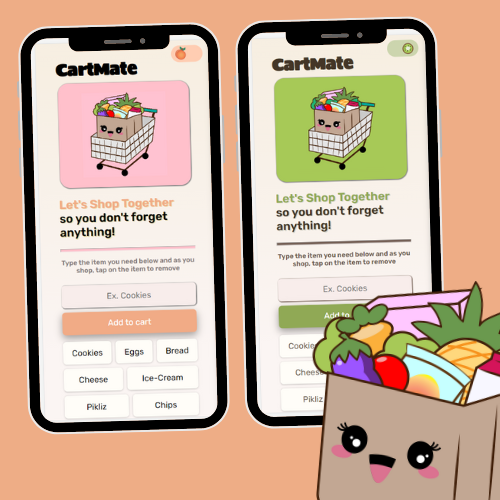

# Scrimba- Firebase Mobile App

## Table of contents

- [Overview](#overview)
  - [The challenge](#the-challenge)
  - [Screenshot](#screenshot)
  - [Links](#links)
- [My process](#my-process)
  - [Built with](#built-with)
  - [What I learned](#what-i-learned)
  - [Continued development](#continued-development)
  - [Useful resources](#useful-resources)

## Overview
Created a grocery list mobile app with JavaScript

### The challenge

Users should be able to:

- Add grocery items to the list using the ‘Add to Cart’ button and it should  appear at the bottom of the screen
- Remove items by tapping on item button
- Use the toggle button to navigate between peaches&cream and kiwi mode (Peach or green screen).

### Screenshot

### Links

- Solution URL: https://github.com/Jud1th1/Firebase-App
- Live Site URL: https://cartmate-groceryapp.netlify.app/

## My process
-	Following along with Scrimba, we started off with our HTML layout and CSS styling
-	I took advantage of going along with adding my own CSS styling as the video was going along by adding some header text that could cue the user to what the app was called, and how to use it. I also changed the colors to orange and pink (peaches and cream) to match the theme of groceries and food. 
-	We did some practice using Firebase to learn how to export a Firebase database to our project, fetch it, and set it to test mode for this project. (Word doc notes included)
-	We set up our JavaScript by getting the elements needed for this app to be functional (the text field and button), added event listeners for the click function, imported Firebase, set up variables with arguments to give the app settings, use the database and set up a reference for the shopping list. Afterward, we wrote the JS code that would add items to the dom, and rewrote some code for clarity such as replacing our innerHTML with a createElement for easier use. Then finally we added a variable and eventListener to remove items. We encountered some bugs here such as the last item on the list not being deleted due to our onValue reference which we fixed by adding an if-else statement for if our snapshot (any value) exists. 
-	Along the way of this tutorial, we were challenged to execute the code before continuing the video, which helped with retention of how to call items, set up functions, and troubleshoot. 
-	Once the project was finalized, I went back in to add some final touches to my CSS stylings such as creating a pure CSS toggle feature to change between a peaches and cream (orange theme mode) and kiwi (green and brown) theme mode. I learned JS for switching between light and dark mode and used that here by adding the function to the bottom of my page and then adding the green style elements to my CSS. 
-   Another proud moment for me in this project was the grocery cart and bag images that I made myself in Adobe Illustrator. I used favicon.io to convertor my png image into the favicon icon needed 
-	This project took about 12 hours, since I rewatched it to make sure I understood the JS but it was well worth it 😊 

### Built with

- HTML
- Flexbox
- CSS
- Pure CSS toggle
- Javascript
- Firebase
- Mobile workflow

### What I learned

-	How to build a grocery list with JavaScript
-	How to use/import a database to my project
-	How to add my project to my phone to use as a mobile app (I’m very proud of this accomplishment) 

### Continued development

I plan on learning more about how to use the database for future projects such as a social media app for tech professionals, and some e-commerce apps. 

I also will continue learning Javascript (Primarily with FreeCodeCamp practices)

### Useful resources

- https://scrimba.com/learn/firebase   //Scrimba Tutorial
- https://console.firebase.google.com/u/0/    //Firebase  
- https://favicon.io    //Favicon convertor
- https://www.w3schools.com/howto/howto_js_toggle_dark_mode.asp   //Dark/light mode
- https://codepen.io/Jud1th1/pen/bGmgYRE  //my toggle codepen